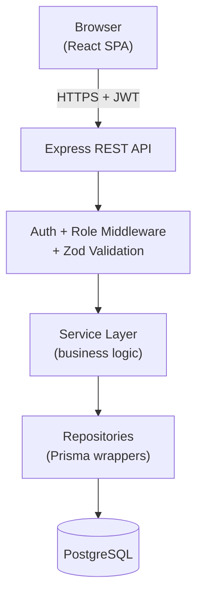
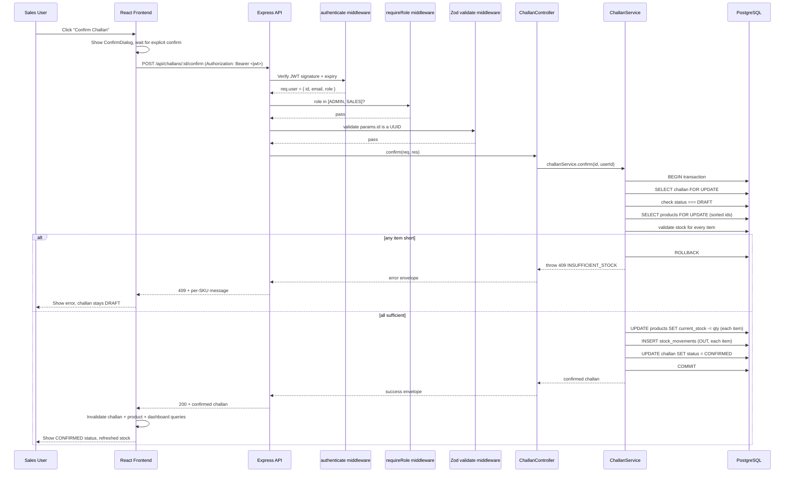
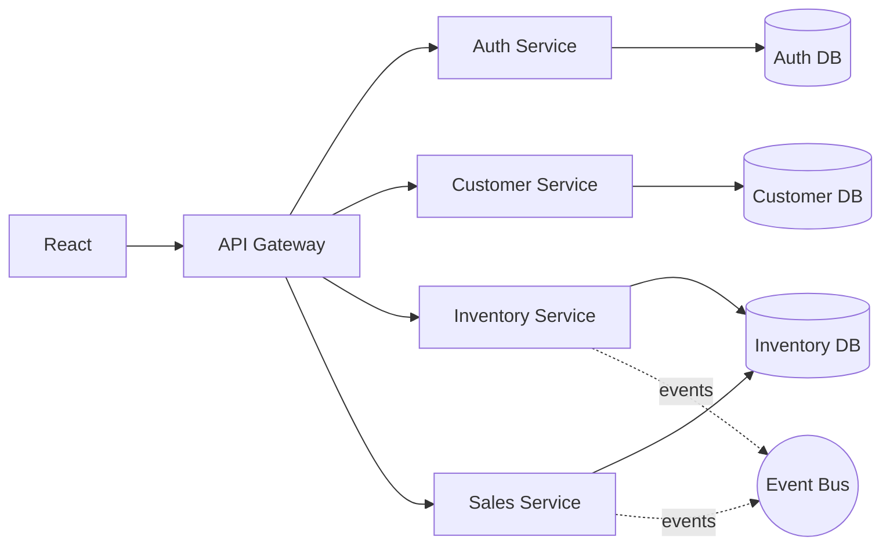

# Architecture

## High-Level Architecture

## Component Responsibilities

| Layer | Responsibility | Must NOT do |
|---|---|---|
| **Routes** (`src/routes/*.ts`) | Wire an HTTP verb + path to middleware + a controller | Contain business logic |
| **Middleware** (`src/middleware/*.ts`) | Cross-cutting concerns: JWT verification, role checks, request validation, error formatting | Know about specific business rules |
| **Controllers** (`src/controllers/*.ts`) | Parse `req`, call exactly one service method, shape the HTTP response | Talk to Prisma directly, contain conditionals about business rules |
| **Services** (`src/services/*.ts`) | **All business logic lives here** — validation beyond shape, transactions, orchestration | Know about `req`/`res` |
| **Repositories** (`src/repositories/*.ts`) | Thin Prisma query wrappers, one per entity | Contain business rules |
| **Prisma / PostgreSQL** | Persistence, constraints, transactions | — |

This is a **modular monolith**, not microservices. Section "Architecture Evolution" below explains why that's the right call at this size.

## Request Lifecycle: "User clicks Confirm Challan"

## The Challan Confirmation Transaction, Step by Step

Implemented as a single `prisma.$transaction(async (tx) => {...})` in `apps/backend/src/services/challan.service.ts`.

1. **Lock the challan row** — `SELECT ... FROM challans WHERE id = :id FOR UPDATE`. If a second "confirm" request for the *same* challan arrives while the first is still running, it blocks here until the first transaction commits or rolls back.
2. **Re-check status is DRAFT** — after acquiring the lock, re-read the status. If the first request already flipped it to `CONFIRMED`, the second correctly fails with `409 CHALLAN_NOT_DRAFT` instead of double-confirming. This is what makes a challan impossible to confirm twice.
3. **Lock every involved product row, in a fixed sorted order** — `SELECT ... FROM products WHERE id IN (...) ORDER BY id FOR UPDATE`. Sorting the IDs before locking means every transaction in the app acquires product locks in the same global order, which is the standard technique to prevent deadlocks: if transaction A needs products [1, 2] and transaction B needs products [2, 1], without a fixed order A could lock 1 and wait for 2 while B locks 2 and waits for 1 — a deadlock. Sorting both to [1, 2] means both attempt to lock 1 first, so one simply waits for the other instead of deadlocking.
4. **Validate stock for every line item before writing anything** — if any item's `current_stock < quantity`, the transaction throws immediately. Nothing has been written yet, so the rollback is trivial and no product's stock is ever partially updated (Rule 3 from the case study).
5. **Only after every item passes**: decrement each product's stock, insert one `OUT` stock movement per item (with the challan number in the `reason` field for traceability), and update the challan's status to `CONFIRMED`.
6. **Commit.** If anything in steps 1–5 throws, the entire transaction rolls back — the challan stays `DRAFT`, and no stock or movement record changes.

### Why this prevents overselling under concurrency

Picture two Sales reps trying to sell the last unit of the same product at the same instant, in two separate Draft challans. Both requests reach step 3 and both try to lock that product's row. Postgres grants the lock to whichever transaction arrives first; the second **blocks** until the first either commits or rolls back. Once the first commits (stock now 0), the second's lock is granted, it re-reads the now-current stock, sees 0 available, and correctly rejects with `INSUFFICIENT_STOCK` — even though at the moment both requests were validated in application code, the row was still showing 1 unit available to each. This is **pessimistic locking**: it trades a small amount of contention (one request waits briefly) for a hard guarantee against overselling, without needing any extra application-level coordination (no distributed locks, no Redis, no application-level mutex).

**Alternative considered and rejected**: optimistic locking via a `version` column (increment on every update, `WHERE version = :expectedVersion` on write, retry on conflict). This avoids the row lock's brief wait, but requires the client to retry on conflict, complicates every write path with retry logic, and is harder for a junior developer to reason about and explain. For a wholesale operations portal where challan confirmation isn't a high-frequency hot path, the simplicity of `SELECT ... FOR UPDATE` easily wins.

## Why Product Snapshots Exist

`challan_items` stores `productNameSnapshot`, `skuSnapshot`, and `unitPriceSnapshot` in addition to `productId`. If historical challans rendered live from `products.name`/`products.unitPrice`, then renaming a product or changing its price next month would silently rewrite the description and value of every past sale — which is both factually wrong (that's not what was actually sold, at that price, on that date) and a compliance problem for a business document like a challan. Snapshotting the fields that matter at creation time means a challan is an immutable historical record, exactly like a paper delivery note would be. `productId` is kept purely so the UI/reports can still link back to "what is this product called today," never to render the challan itself.

## Architecture Evolution

**Current**: React → Node.js modular monolith → PostgreSQL. One deployable backend, one database, layered internally by responsibility.

**If this grew significantly** (many more teams, much higher write volume, need for independent scaling/deployment of, say, inventory vs. sales):

**Why microservices are NOT necessary initially**: this system has four small, tightly related domains (customers, products, stock, challans) that constantly need to join across each other in a single request (a challan needs customer + product + stock, atomically). Splitting them into separate services now would mean either distributed transactions (hard, slow, easy to get wrong) or eventual consistency (acceptable for some domains, not for "don't oversell stock"). A modular monolith gets 90% of the maintainability benefit of microservices — clear module boundaries, one team can own one folder — with none of the operational cost (multiple deployments, service discovery, network failure modes, distributed tracing) until there's an actual scaling or team-size reason to pay for it.
