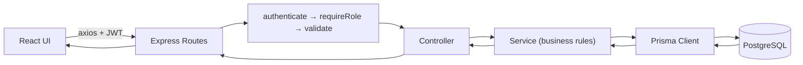
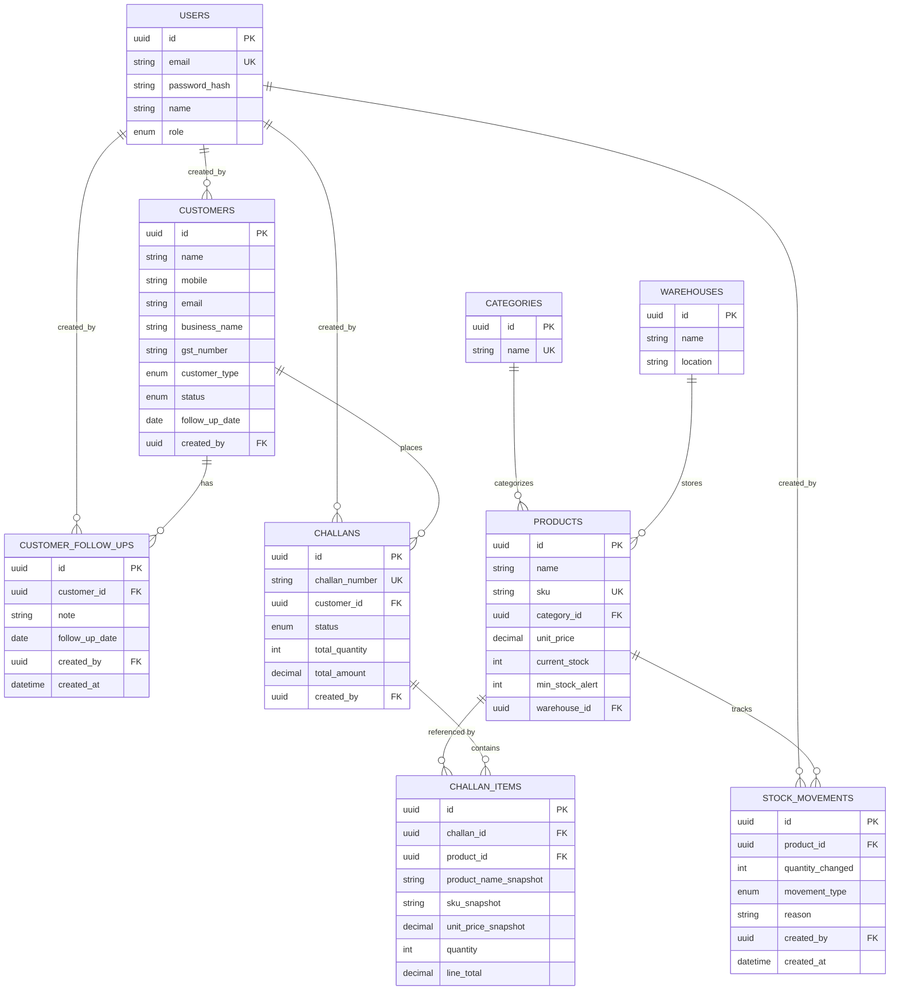
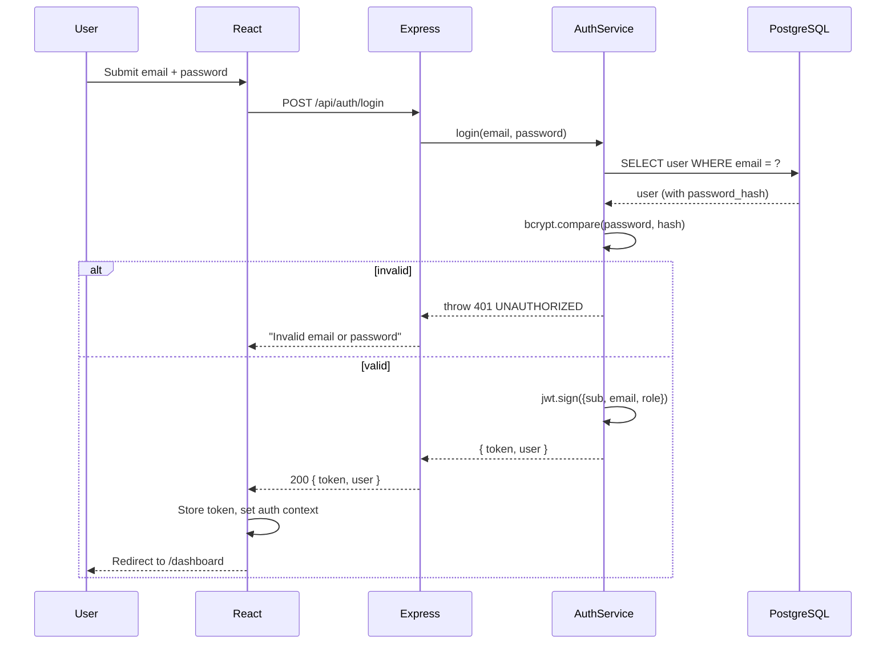
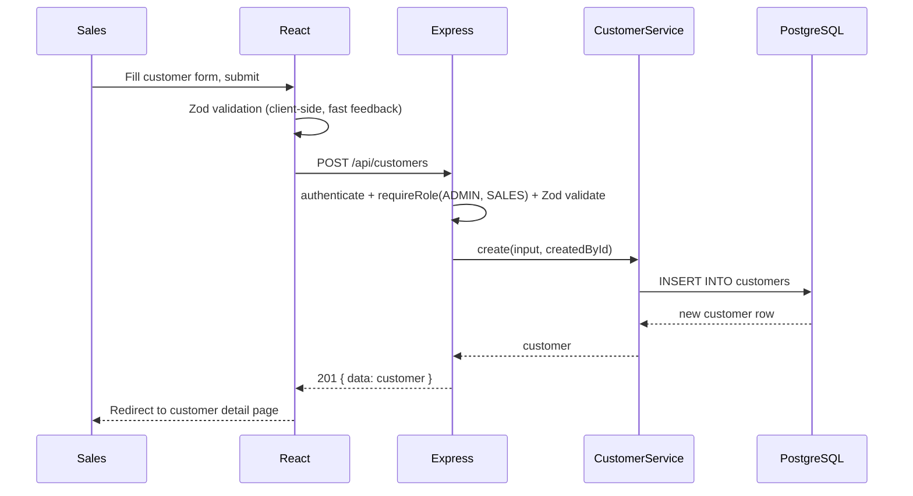
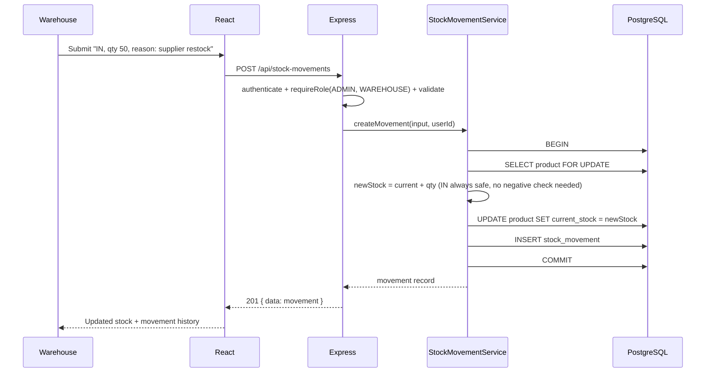
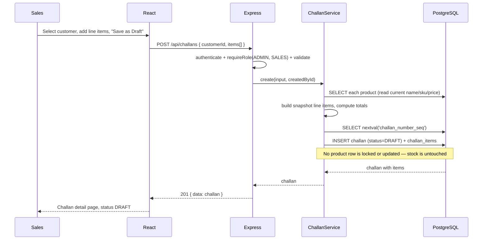
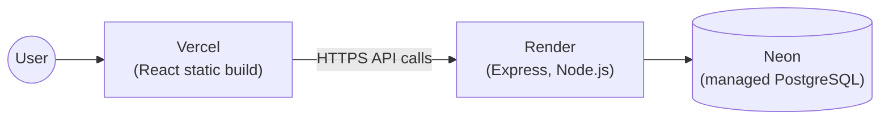
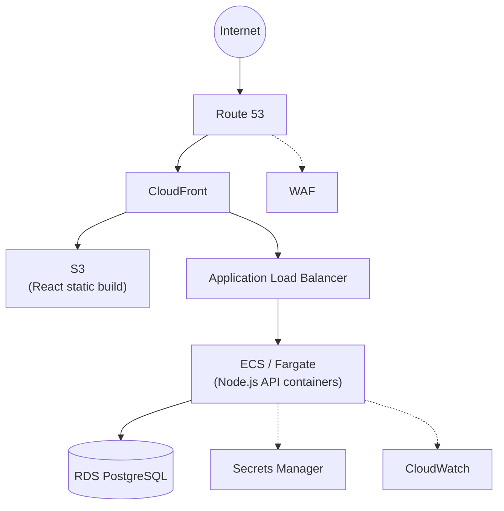

# System Design

## Functional Requirements

- Authenticate users and enforce 4 distinct roles (Admin, Sales, Warehouse, Accounts) on every API call.
- Manage customers: create, edit, search, paginate, view detail, append follow-up history.
- Manage products: create, edit, search, paginate, view detail, low-stock indication.
- Record every stock change as an auditable movement (IN/OUT, quantity, reason, actor, timestamp).
- Create sales challans as Draft (no stock effect), confirm them (atomic stock deduction, validated), cancel them (while still Draft).
- Store an immutable product snapshot on every challan line item.
- Provide a dashboard summary (counts + recent activity).

## Non-Functional Requirements

| Concern | Target for this project | Notes |
|---|---|---|
| Consistency | Stock must never go negative, even under concurrent requests | Enforced via DB transactions + row locks, not application-level checks alone |
| Auditability | Every stock change traceable to a cause | `stock_movements` is append-only; nothing else can change `current_stock` |
| Security | Passwords hashed, tokens signed, roles enforced server-side | bcrypt, JWT, `requireRole` middleware; see Security section |
| Usability | Clear error messages, no raw stack traces to the client | Centralized error handler, consistent JSON envelope |
| Scale | Handle a single wholesale company's internal team (tens of users, thousands of records) | Not designed for multi-tenant SaaS scale — see Scalability |

## Actors

- **Admin** — full access to every module.
- **Sales** — manages customers and the challan lifecycle; read-only on products/stock.
- **Warehouse** — manages products and stock movements; read-only on challans; no customer access.
- **Accounts** — read-only across customers, products, challans, and stock movements.

## Use Cases (selected)

- *As Sales*, I create a customer, later add a follow-up note without losing the previous ones, and eventually create a challan for them.
- *As Sales*, I build a Draft challan with several products, confirm it, and the system either fully applies it or tells me exactly which SKU is short.
- *As Warehouse*, I add incoming stock and see it reflected immediately, with a movement record explaining why.
- *As Accounts*, I can see everything happening across customers/products/challans but cannot change any of it.
- *As Admin*, I can do everything the other three roles can.

## Architecture

See `docs/architecture.md` for the full layered diagram and component responsibilities. Summary: React SPA → Express REST API → service layer (business logic) → Prisma → PostgreSQL, all behind JWT auth + role middleware.

## Data Flow



## ER Diagram



## Sequence Diagrams

### Login



### Customer Creation



### Stock IN



### Challan Creation (Draft)



### Challan Confirmation

See the full step-by-step diagram and explanation in `docs/architecture.md` ("Request Lifecycle: User clicks Confirm Challan" and "The Challan Confirmation Transaction, Step by Step").

## Error Handling

Every error — validation, not-found, forbidden, conflict, or unexpected — flows through one Express error-handling middleware (`src/middleware/errorHandler.ts`) and is returned in one shape:

```json
{ "success": false, "message": "human-readable message", "error": { "code": "MACHINE_READABLE_CODE", "details": null } }
```

`AppError` (a small custom `Error` subclass) carries the intended HTTP status and code; services throw it directly (`AppError.conflict('INSUFFICIENT_STOCK', ...)`), and controllers never need their own try/catch — `asyncHandler` forwards rejected promises to the error middleware automatically. Zod validation errors and known Prisma errors (e.g. unique constraint violations) are also caught and reshaped into the same envelope. In production, unexpected (5xx) errors return a generic message; the real error is logged server-side via Pino, never leaked to the client.

## Security

- **Password hashing**: bcrypt, cost factor 10.
- **Authentication**: JWT, `HS256`, signed with a secret from environment configuration, never hardcoded.
- **Authorization**: `requireRole` middleware on every write endpoint and every role-restricted read.
- **Transport hardening**: Helmet (sensible security headers), CORS locked to the configured `FRONTEND_URL` origin only.
- **Input validation**: Zod schemas on every request body/query/params before it reaches a controller.
- **Secrets**: environment variables only, `.env` files gitignored, `.env.example` documents required shape without real values.
- **SQL injection**: not possible via the ORM layer (Prisma parameterizes everything); the few raw SQL queries used for row-locking (`SELECT ... FOR UPDATE`) use Prisma's tagged-template `$queryRaw`, which parameterizes interpolated values automatically.
- **Rate limiting**: basic IP-based limit on `/auth/login` only.
- **What's explicitly NOT done** (documented honestly, not claimed): no refresh token rotation, no account lockout after repeated failures, no 2FA, no CSRF protection (not needed for a pure JSON API with no cookie-based session), no dependency vulnerability scanning pipeline, no secrets manager (env vars only). This system should not be described as "production-secure" — see Known Limitations in the README.

## Scalability

Current design comfortably handles a single company's internal team and a catalog/customer base in the thousands. If load grew significantly:

- The backend is stateless (JWT, no server-side sessions) — horizontal scaling behind a load balancer requires no code changes.
- The database would become the bottleneck first. Read replicas for list/search endpoints, and connection pooling (e.g. PgBouncer, or Neon's built-in pooler) would be the first scaling levers, well before considering microservices.
- The one place scale interacts with correctness is the challan confirm transaction's row locks — under very high concurrent-write volume on the *same* hot product, this serializes those specific writes. That's the correct tradeoff (correctness over raw throughput) for inventory; if a specific product became an extreme hot-spot, a queue-based "reservation" system ahead of the transaction would be the next design step, not something implemented here.

## Availability

Single-instance deployment (Render's free web service, single Neon Postgres). No built-in failover. A production-grade setup would run at least two backend instances behind a load balancer and use a managed Postgres with automated failover (Neon/RDS both support this on paid tiers). Documented as a gap, not implemented, to stay within the case study's "don't spend money" constraint.

## Backup and Recovery

Not implemented in this project. What a production deployment would add: automated daily Postgres backups with point-in-time recovery (Neon and RDS both offer this as a managed feature), and a documented restore runbook tested at least once. Currently, the only recovery path is re-running migrations + seed against a fresh database, which discards all real data — acceptable for a demo, not for production.

## Observability

Implemented: a `/health` endpoint that checks live DB connectivity, and structured JSON request logs via `pino`/`pino-http` (method, URL, status code, response time; secrets and auth headers are redacted, never logged).

Documented but not implemented — how a production deployment would extend this:
- **CloudWatch** (if on AWS) or a hosted log sink for the Render/Vercel logs, with alerting on 5xx rate.
- **OpenTelemetry** for distributed tracing across the frontend → API → database, useful once there's more than one backend instance.
- **Prometheus + Grafana** for metrics (request rate, latency percentiles, DB pool utilization) and dashboards.

## Deployment Architecture

**Actual (free-tier) target** — see `docs/deployment.md` for the full runbook:



**Optional AWS architecture** (documented only — not deployed, purely a bonus discussion of how this would look at real production scale):



| Piece | Why |
|---|---|
| Route 53 | DNS |
| CloudFront | CDN for the static frontend + edge caching, HTTPS termination |
| S3 | Hosts the built React static assets |
| WAF | Basic protection against common web exploits at the edge |
| ALB | Distributes API traffic across backend containers, health-checks them |
| ECS/Fargate | Runs the Express API as horizontally-scalable containers without managing EC2 instances directly |
| RDS PostgreSQL | Managed Postgres with automated backups, multi-AZ failover available |
| Secrets Manager | Stores `JWT_SECRET`/`DATABASE_URL` instead of plain environment variables |
| CloudWatch | Centralized logs + metrics + alarms |

This AWS design was **not implemented** — the case study explicitly treats AWS deployment as optional/bonus, and the actual deployment uses free-tier services (Neon/Render/Vercel) instead, per the assignment's "do not spend money" constraint.
